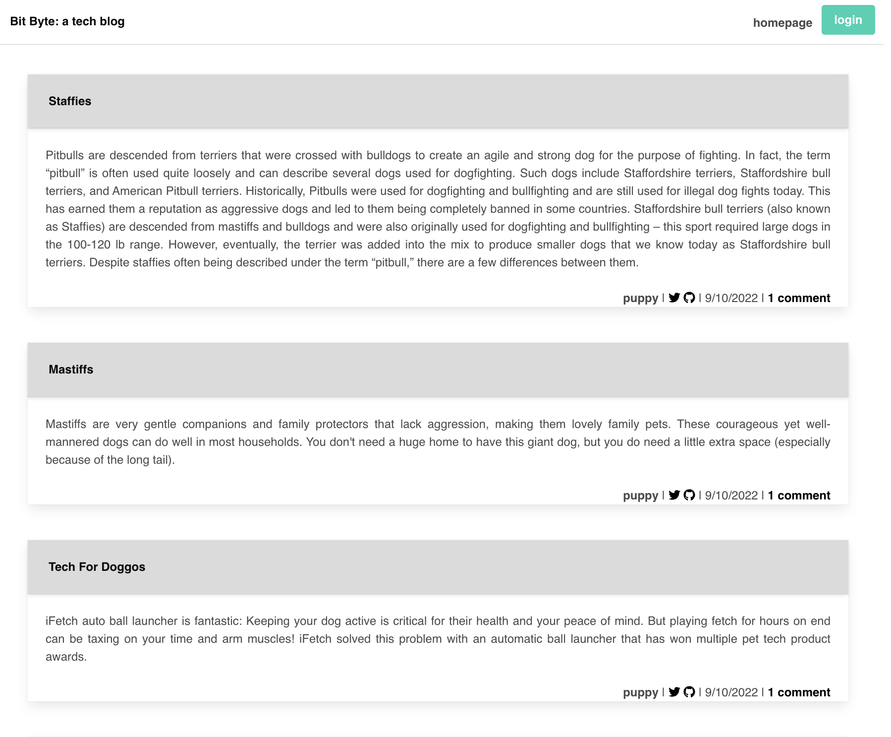
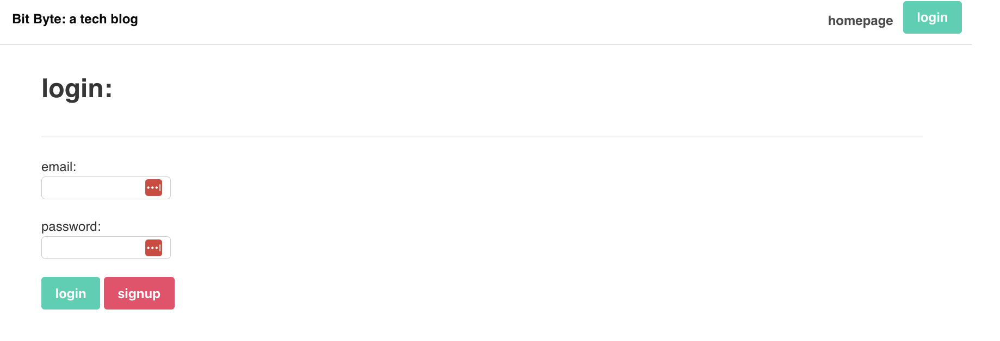
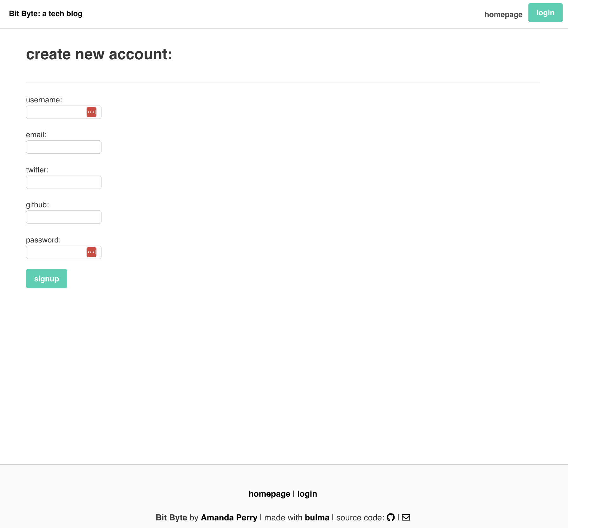
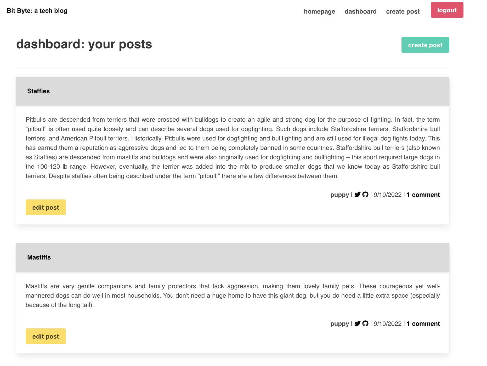
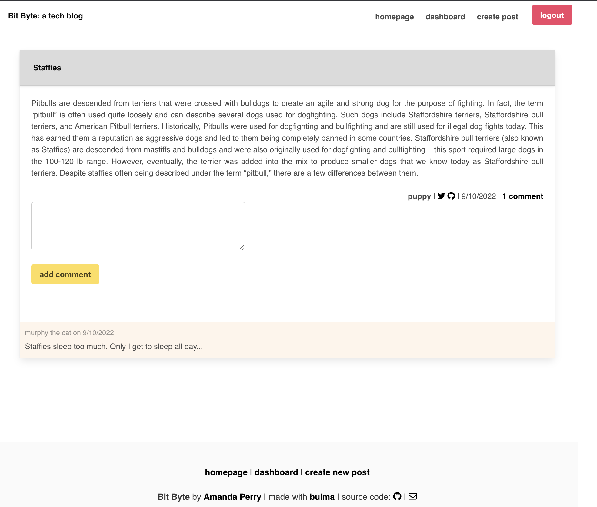
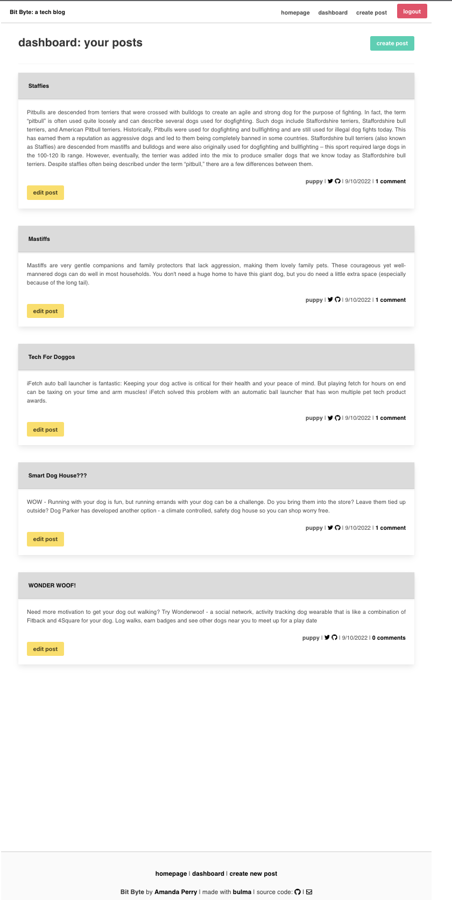

# Bit Bites Tech Blog

## Description
SocialMedia Application gathering point to post, discuss and promote all things tech. Once account is created, users are able to create posts and view from their own dashboard. Users may also make and read comments made by others.

## Table of Contents
  - [Usage](#usage)
  - [Tests](#tests)
  - [Installation](#installation)
  - [Screenshots and Video](#screenshots_video)
  - [Contributing](#contributing)
  - [Questions](#questions)

  - [License](#license)
      

## Usage
Users can post and see posts by others; tag topics of discussion; comment and upvote other's posts. This application uses node.js packages: express, express-handlebars, express-session, connect-session-sequelize, sequelize, mysql2, dotenv, jest, bulma and bcrypt

## Tests
Test file run through npm test with jest. CRUD tests run through your choice; I use Insomnia.

## Installation
Install Node.js, Clone repo , 
In terminal: 
  ~npm init or npm init -y,
  ~npm i <package name> for each node.js packages: express, express-handlebars, express-session, connect-session-sequelize, sequelize, mysql2, dotenv, bulma, jest and bcrypt
  ~create your .env file to include your database, username, and password for mysql

View live on heroku
https://ancient-meadow-81105.herokuapp.com

## Screenshots and Video
View live on heroku
https://ancient-meadow-81105.herokuapp.com

## Contributing
coming soon

## Questions

Have questions?
You can find me on GitHub:
https://github.com/BeKind-Rewind

Or email me at:
Challenge641@gmail.com

## License

Licensed under the [MIT](https://choosealicense.com/licenses/mit/) license.
    